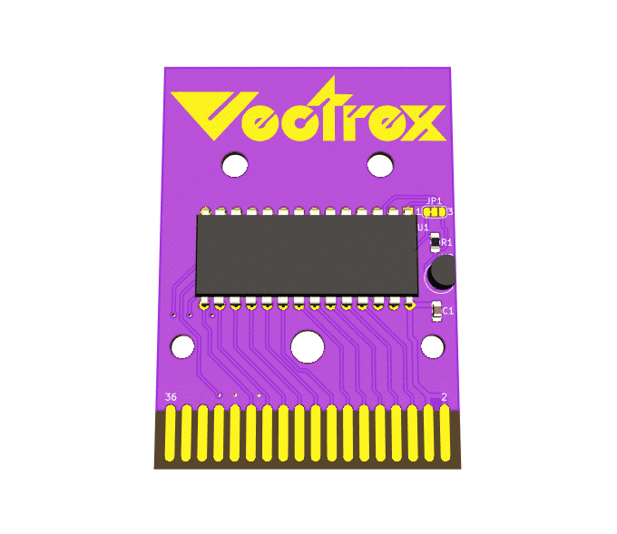
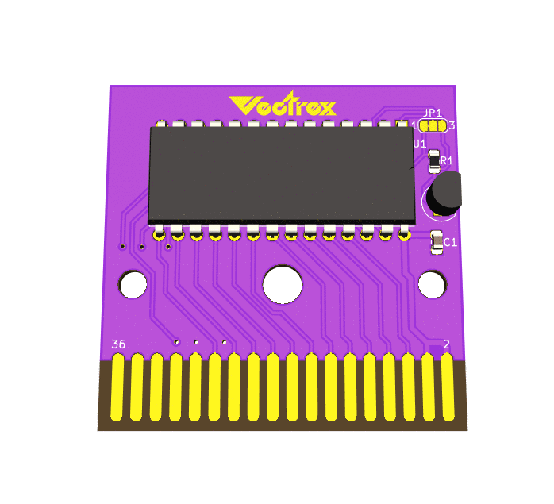
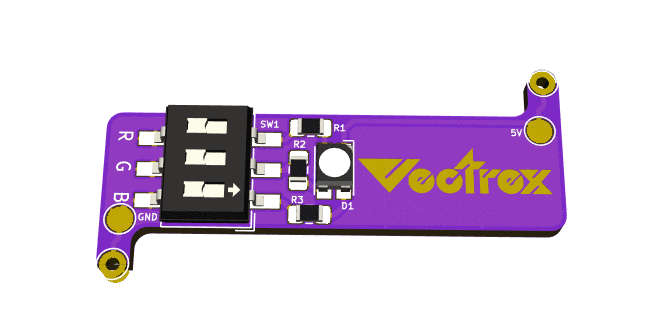
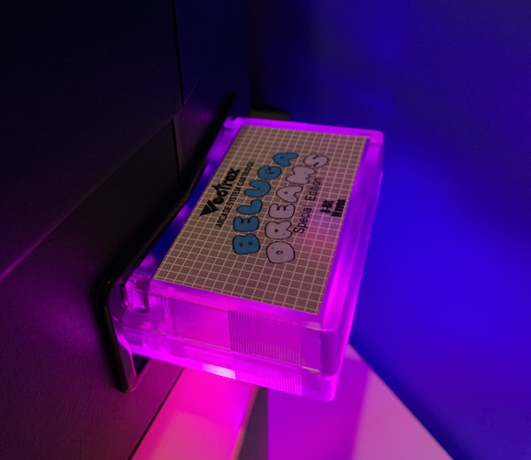

Vectrex Cartridge and Vectrex LED board
===

So you wanna produce a Vectrex game and you need a 32KB cartridge with high score save support? Here's your reference design! Order it as is or customize it with your own graphics.  Got a 64KB game that uses John Dondzilla PB6 bankswitching?  No problem, just cut and solder jumper for the 64KB option. Don't stuff the DS2431 or R1 pull up if you don't need the high score feature.

What makes this Vectrex Cartridge design different from others out there?  Well, the design is originally based on Frank Buss' Vectrex cart edge connector, but it has been significantly fixed.  The soldermask has been removed from around all of the fingers, the fingers themselves are not as wide as Frank's, and the spacing of everything has been updated to match original carts as close as possible.

Yes these fit in [Sean Kelly reproduction cartridge shells](http://www.vectrexmulti.com/order2.html#!/Vectrex-Empty-Cartridge-Shells/c/38886086/offset=0&sort=normal) perfectly!

Also included here is a simple RGB LED board add-on.  Maybe you already have a PCB but you don't have the cool LED? Easy, just add this one to the bottom.  It fits perfectly under most 28 pin 32KB/64KB EPROMS.

Got a Custom PCB logo request?
===
Join the [VEXTREME Discord server](https://discord.gg/VDssGVJ) to chat with @technobly about your request

BOM and Parts ordering
===

All the parts are described in [Bill of Materials](bom/)

You can use these Digi-Key shared carts to order the parts!
[Vectrex Cartridge](https://www.digikey.com/short/z9jq1b) or
[Vectrex LED](https://www.digikey.com/short/z9j8bp)

Ordering PCB's
===

OSHPark is a good place to order with purple or the new "after dark" theme color scheme.  You can upload the KiCad `vextrex-cartridge-tall.kicad_pcb` or `vextrex-cartridge-short.kicad_pcb` there directly.  I would download this entire Github repo ZIP file first though instead of just trying to save the PCB file from your browser.  Here's a shared link for [Vectrex LED v1.0](https://oshpark.com/shared_projects/dIH6AJOJ)

Another way to order PCB's is by using the included [gerbers-tall-design](gerbers/vectrex-cartridge-tall-v1.2.zip) or [gerbers-short-design](gerbers/vectrex-cartridge-short-v1.2.zip) and uploading those with all of the necessary specs to companies like [PCBWay](https://www.pcbway.com) or [JLCPCB](https://jlcpcb.com)

Don't forget to make your board finish at least ENIG (gold flash) with a 45 degree chamfered edge.  Go with hard gold contacts if you really want to spend some money, and make a cart that will last forever.

LICENSE
===

CERN OHL v2.0 Permissive - essentially do whatever you want, but if you make a ton of money off of this... [buy me some coffees please!](https://buymeacoffee.com/XzUGYrhL3)  Full [LICENSE here](LICENSE)
